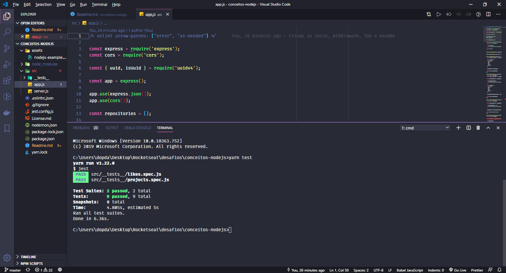

<h3 align="center">
  Desafio 02: Conceitos do Node.js
</h3>

“Não espere para plantar, apenas tenha paciência para colher”!</blockquote>

  

  

  

  

  

  <a href="#rocket-sobre-o-desafio">Sobre o desafio</a>&nbsp;&nbsp;&nbsp;|&nbsp;&nbsp;&nbsp;
  <a href="#memo-licença">Licença</a>&nbsp;&nbsp;&nbsp;|&nbsp;&nbsp;&nbsp;
  <a href="#medal-créditos">Créditos</a>

## :rocket: Sobre o desafio

Aplicação feita para treinar a parte conceitual do primeiro módulo de Node.js ensinado pela @Rocketseat

Desenvolvido para armazenar repositórios de portfólio onde é permitido a criação, listagem, atualização e remoção dos repositórios além de permitir que os repositórios possam receber "likes".

  

### Template da aplicação

O template utilizado está disponível na seguinte url: **[Acessar Template](https://github.com/Rocketseat/gostack-template-conceitos-nodejs)**

  

## :memo: Licença

Esse projeto está sob a licença MIT. Veja o arquivo [LICENSE](LICENSE.md) para mais detalhes.

---
## :trophy: Créditos

Feito com 💜 by Rocketseat & alterado by Douglas Silva 💪 [Entre na nossa comunidade!](https://discordapp.com/invite/gCRAFhc)
